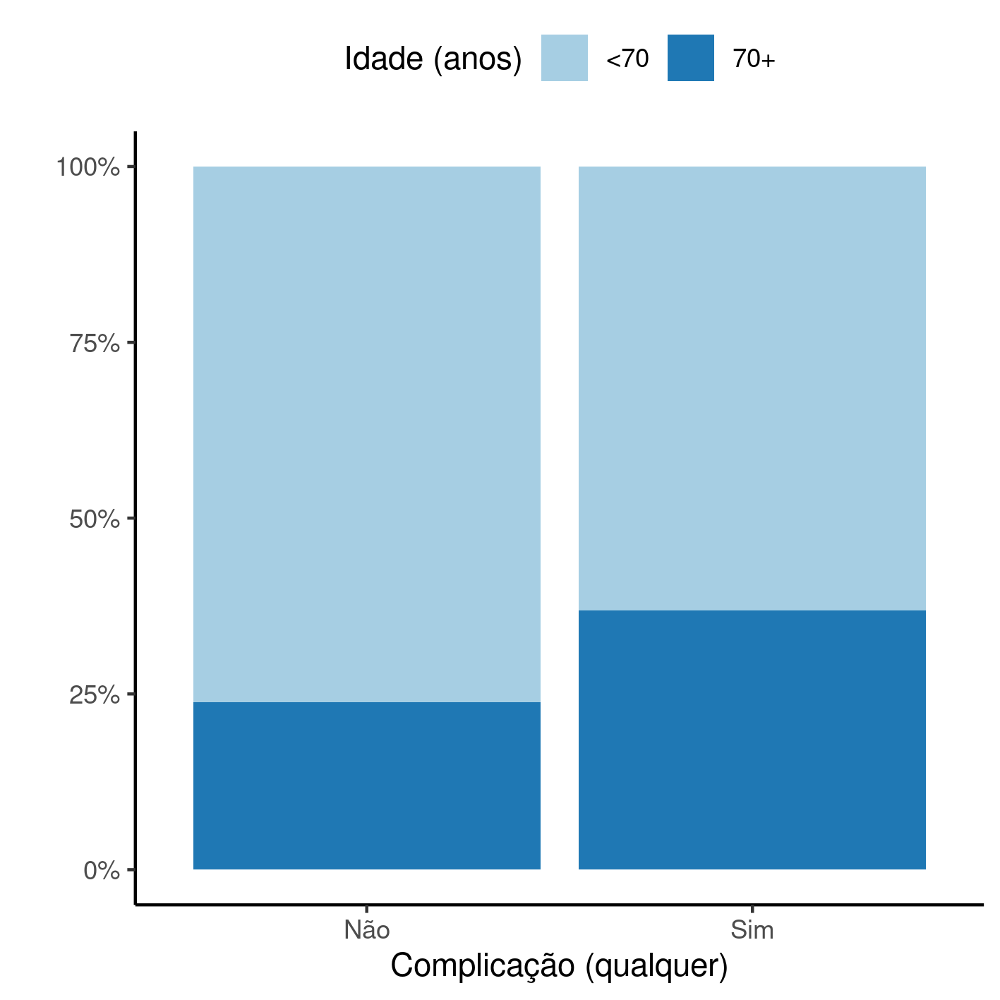

```{r setup, include=FALSE}
knitr::opts_chunk$set(echo = FALSE)
knitr::opts_knit$set(root.dir = normalizePath(".."))
options(scipen = 999)
library(pander)
library(knitr)
panderOptions('table.style', 'rmarkdown')
panderOptions('table.split.table', 160)
```

---

\newpage

**Prevalência de complicações em idosos após revisão de artroplastia total de quadril em hospital de referência no RJ (2016 -- 2019)**

**Histórico do documento**

```{r history}
Version <- c("01")
Changes <- c("Versão inicial")
history <- cbind(Version, Changes)
colnames(history) <- c("Versão", "Alterações")
# pander(history, split.cells = 70)
kable(history)
```

---

# Lista de abreviaturas

# Contexto

## Objetivos

## Recepção e tratamento dos dados

# Metodologia

```{r results, include=FALSE}
source("scripts/results.R", encoding = 'UTF-8')
```

## Variáveis

### Desfechos primário e secundário

### Covariáveis

## Análises Estatísticas

Esta análise foi realizada utilizando-se o software `R` versão `r getRversion()`.

# Resultados

## População do estudo e acompanhamento

Foram incluídos `r Nobs_final` participantes no estudo, com
idade média (DP) `r inline_text(tab_desc, variable = idade)`.
`r inline_text(tab_desc, variable = sexo, level = "M")` dos participantes incluídos eram homens (Tabela 1).

Das comorbidades avaliadas
`r inline_text(tab_desc, variable = has)` possuiam HAS,
`r inline_text(tab_desc, variable = dm)` possuíam Diabetes mellitus e
`r inline_text(tab_desc, variable = tabagismo)` eram tabagistas (Tabela 1).
O nível de risco cirúrgico (ASA) mais frequente na população de estudo foi ASA 2 com
`r inline_text(tab_desc, variable = asa, level = "2")` dos participantes incluídos.

Este estudo considerou a faixa etária de 70 anos ou mais como fator de risco para complicações pós ATQ.
`r inline_text(tab_desc, variable = group, level = "70+")` eram do grupo de risco de complicações.
A taxa de complicações observada no período do estudo foi relativamente baixa com apenas
`r inline_text(tab_desc, variable = outcome, level = "Sim")` participantes experimentando algum tipo de complicação.
Dos 84 participantes que não experimentaram complicações 31 (36.9%) eram do grupo de risco, enquanto que este grupo totalizou 201 (23.9%) dos casos livres de complicação (Tabela 1, Figura 1).

```{r tab_desc}
tab_desc %>%
    as_kable(
    caption = "**Tabela 1** caption"
  )
```

```{r fig1, fig.cap="**Figura 1** caption"}
# 
knitr::include_graphics("../figures/outcome.png", error = FALSE)
```

## Prevalência de complicações

```{r}
est_crude <- coef(mod_crude)[2] %>% exp()
```

O modelo logístico usado nesta análise é capaz de estimar a OR de complicação em idosos com 70 anos ou mais, comparado com o grupo com idades inferiores.

Foi criado um modelo simplificado para servir como base de referência para interpretação do modelo final (Estimativa bruta, Tabela 2).
A OR bruta entre o grupo sob exposição e o grupo sem exposição é
`r format.float(est_crude)`,
e esta OR significativamente acima de 1.
Isto significa que, mesmo antes de ajustar pelos outros fatores, há evidência de risco aumentado de ocorrência complicações após revisão de ATQ neste grupo, quando comparado ao grupo sem exposição.
Neste caso a estimativa de prevalência relativa no grupo com exposição é aproximadamente
`r format.pct(est_crude-1, digits = 0)`
maior que a prevalência no grupo sem exposição.

```{r tab_inf}
tab_inf %>%
    as_kable(
    caption = "**Tabela 2** Prevalência de complicações em idosos com 70 anos ou mais, ajustada por sexo, HAS, ASA, DM e hábitos tabagistas."
  )
```

# Observações e limitações

# Conclusões

# Referências

- **SAP-2022-006-LP-v01** -- Plano Analítico para Prevalência de complicações em idosos após revisão de artroplastia total de quadril em hospital de referência no RJ (2016 -- 2019)

# Apêndice

## Análise exploratória de dados

```{r A1, fig.cap="**Figura A1** Distribuição da idade na população do estudo."}
# 
# knitr::include_graphics("../figures/distr_age.png", error = FALSE)
```

## Processo de modelagem

```{r tab_inftab_inf_apx}
tab_inf_apx %>%
    as_kable(
    caption = "**Tabela A1** Versão alternativa da tabela 2."
  )
```

## Análises associadas

Esta análise é parte de um projeto maior e é suportada por outras análises, disponíveis abaixo.

**Preparo da base de dados de estudo retrospectivo de complicações após revisão de artroplastia total de quadril em idosos**

<https://github.com/philsf-biostat/SAR-2021-023-LP>

## Disponibilidade

Tanto este documento como o plano analítico correspondente (**SAP-2022-006-LP-v01**) podem ser obtidos no seguinte endereço:

<!-- Este documento pode ser obtido no seguinte endereço: -->

<https://philsf-biostat.github.io/SAR-2022-006-LP/>

<!-- O cliente solicitou que esta análise seja mantida confidencial. -->
<!-- Tanto este documento como o plano analítico correspondente (**SAP-2022-006-LP-v01**) portanto não foram publicados online e apenas o título e o ano da análise foram incluídas no portfólio do consultor. -->
<!-- O portfólio pode ser visto em: -->

<!-- <https://philsf-biostat.github.io/> -->

## Dados utilizados

A tabela A1 mostra a estrutura  da tabela de dados analíticos.

```{r data}
analytical_mockup %>%
  pander(caption = "**Tabela A2** Estrutura da tabela de dados analíticos")
```

Os dados utilizados neste relatório não podem ser publicados online por questões de sigilo.
