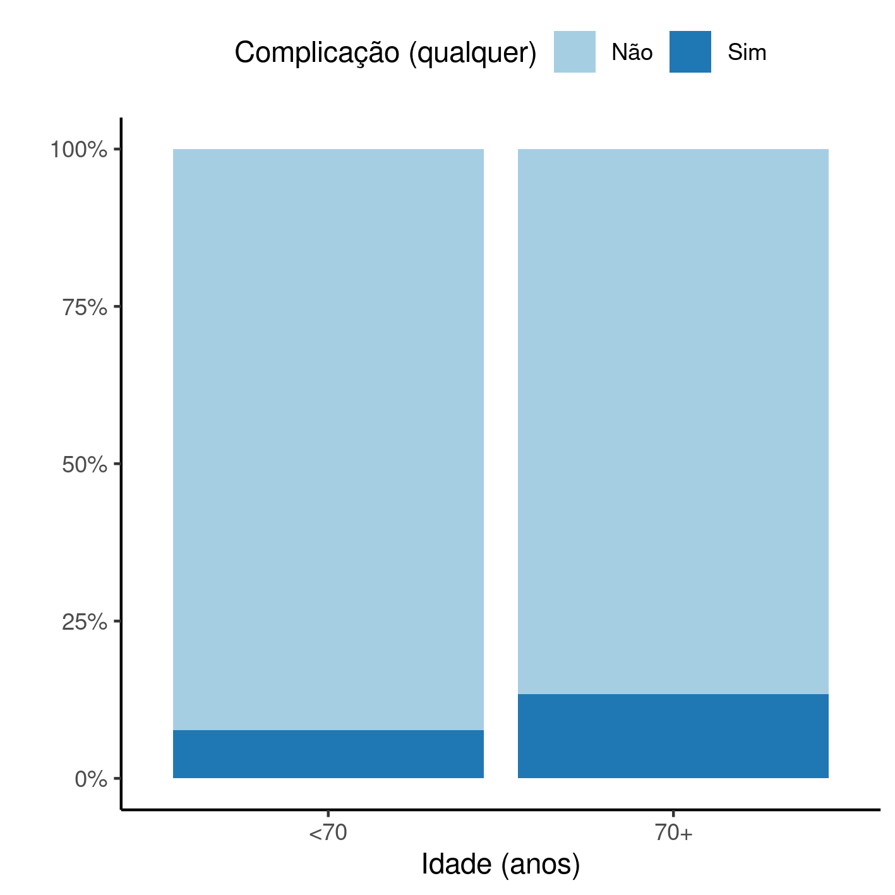

```{r setup, include=FALSE}
knitr::opts_chunk$set(echo = FALSE)
knitr::opts_knit$set(root.dir = normalizePath(".."))
options(scipen = 999)
library(pander)
library(knitr)
panderOptions('table.style', 'rmarkdown')
panderOptions('table.split.table', 160)
```

---

\newpage

**Prevalência de qualquer complicação em idosos após artroplastia total de quadril primária em hospital de referência no RJ (2016 -- 2019)**

**Histórico do documento**

```{r history}
Version <- c("01")
Changes <- c("Versão inicial")
history <- cbind(Version, Changes)
colnames(history) <- c("Versão", "Alterações")
# pander(history, split.cells = 70)
kable(history)
```

```{r results, include=FALSE}
source("scripts/results.R", encoding = 'UTF-8')
```

---

# Lista de abreviaturas

- DP: desvio padrão
- IC: intervalo de confiança
- OR: razão de chances (*odds ratio*)
<!-- - IMC: índice de massa corpórea -->

# Contexto

## Objetivos

Estimar o risco de qualquer complicação após ATQ primária em idosos a partir de 70 anos no período entre 2016 e 2019, quando comparados a pacientes mais novos.

## Recepção e tratamento dos dados

A base de dados original possuía
`r Nvar_orig`
variáveis coletadas de
`r Nobs_orig`
observações.
A idade foi calculada entre a data de nascimento e a data de cirurgia, em anos completos, com precisão de calendário.
O grupo de expostos foi definido por uma variável indicadora que é positiva quando o participante incluído tem 70 anos ou mais no dia da cirurgia.
O processamento de limpeza e manipulação de dados está descrito em relatório técnico, onde foi feita a identificação de complicações individuais e o agrupamento de complicações em um desfecho composto, usado nesta análise (**SAR-2021-023-LP-v01**).
Depois dos procedimentos de limpeza e seleção
`r Nvar_final`
variáveis foram incluídas na análise com
`r Nobs_final`
observações.

# Metodologia

## Variáveis

### Desfechos primário e secundário

O desfecho deste estudo será um desfecho composto, agrupando todas as complicações identificadas na base.
Um estudo posterior investigará as prevalências de complicações individuais.

**Desfecho primário**

Chance de complicação após revisão de ATQ em idosos.

### Covariáveis

Planejamos usar as seguintes variáveis para ajuste da razão de chances entre os grupos exposto e não exposto:

- Sexo
- HAS
- ASA
- DM
- Tabagismo

## Análises Estatísticas

O perfil epidemiológico dos participantes do estudo será descrito na baseline.
As características demográficas
(sexo, idade e IMC)
e clínicas
<!-- ( [vars] ) -->
serão descritas como
média (DP)
<!-- mediana (IIQ) -->
ou frequência e proporção (%), conforme apropriado.
As distribuições das características dos participantes serão resumidas em tabelas e visualizadas em gráficos exploratórios
A razão de chances de qualquer complicação entre os grupos exposto e não exposto serão estimadas através com um modelo de regressão logística.
A fim de avaliar o impacto das covariáveis na estimativa da OR, dois modelos serão utilizados: uma estimativa bruta (apenas entre o desfecho e a exposição) e outra estimativa ajustada que controla pelos outros fatores.
Todas as avaliações serão realizadas como análises de casos completos.
Todas as análises serão realizadas ao nível de significância de 5%.
Todos os testes de hipóteses e intervalos de confiança calculados serão
bicaudais.
Esta análise foi realizada utilizando-se o software `R` versão `r getRversion()`.

# Resultados

## População do estudo e acompanhamento

Foram incluídos `r Nobs_final` participantes no estudo, com
idade média (DP) `r inline_text(tab_desc, variable = idade)`.
`r inline_text(tab_desc, variable = sexo, level = "M")` dos participantes incluídos eram homens (Tabela 1).

Das comorbidades avaliadas
`r inline_text(tab_desc, variable = has)` possuiam HAS,
`r inline_text(tab_desc, variable = dm)` possuíam Diabetes mellitus e
`r inline_text(tab_desc, variable = tabagismo)` eram tabagistas (Tabela 1).
O nível de risco cirúrgico (ASA) mais frequente na população de estudo foi ASA 2 com
`r inline_text(tab_desc, variable = asa, level = "2")` dos participantes incluídos.

Este estudo considerou a faixa etária de 70 anos ou mais como fator de risco para qualquer complicação pós ATQ.
`r inline_text(tab_desc, variable = group, level = "70+")` eram do grupo de risco de qualquer complicação.
A taxa de qualquer complicação observada no período do estudo foi relativamente baixa com apenas
`r inline_text(tab_desc, variable = outcome, level = "Sim")` participantes experimentando algum tipo de complicação.
Dos 84 participantes que não experimentaram qualquer complicação 31 (36.9%) eram do grupo de risco, enquanto que este grupo totalizou 201 (23.9%) dos casos livres de complicação (Tabela 1, Figura 1).

```{r tab_desc}
tab_desc %>%
    as_kable(
    caption = "**Tabela 1** caption"
  )
```

```{r fig1, fig.cap="**Figura 1** caption"}
# 
knitr::include_graphics("../figures/outcome.png", error = FALSE)
```

## Prevalência de qualquer complicação

```{r}
est_crude <- coef(mod_crude)[2] %>% exp()
est_adj <- coef(mod_full)[2] %>% exp()
```

O modelo logístico usado nesta análise é capaz de estimar a OR de complicação em idosos com 70 anos ou mais, comparado com o grupo com idades inferiores.

Foi criado um modelo simplificado para servir como base de referência para interpretação do modelo final (Estimativa bruta, Tabela 2).
A OR bruta entre o grupo sob exposição e o grupo sem exposição é
`r format.float(est_crude)`,
e esta OR significativamente acima de 1.
Isto significa que, mesmo antes de ajustar pelos outros fatores, há evidência de risco aumentado de ocorrência qualquer complicação após revisão de ATQ neste grupo, quando comparado ao grupo sem exposição.
Neste caso a estimativa de prevalência relativa no grupo com exposição é aproximadamente
`r format.pct(est_crude-1, digits = 0)`
maior que a prevalência no grupo sem exposição.

```{r tab_inf}
tab_inf %>%
    as_kable(
    caption = "**Tabela 2** Prevalência de qualquer complicação em idosos com 70 anos ou mais. Estimativa crua e estimativa ajustada por sexo, HAS, ASA, DM e hábitos tabagistas."
  )
```

Após ajustar a prevalência crua pelo sexo, ASA, e presença das comorbidades HAS, DM e hábitos tabagistas, a OR ajustada cresce para
`r format.float(est_adj)` (Modelo Final, Tabela 2).
Isto significa que, após controlar os outros fatores, há evidência de risco ainda maior de ocorrência qualquer complicação após revisão de ATQ neste grupo, quando comparado ao grupo sem exposição.
Neste caso a estimativa de prevalência relativa no grupo com exposição é aproximadamente o dobro da prevalência
(`r format.pct(est_adj-1, digits = 0)` maior)
no grupo sem exposição.

# Observações e limitações

N/A

# Conclusões

# Referências

- **SAP-2022-006-LP-v01** -- Plano Analítico para Prevalência de qualquer complicação em idosos após artroplastia total de quadril primária em hospital de referência no RJ (2016 -- 2019)
- **SAR-2021-023-LP-v01** -- Preparo da base de dados de estudo retrospectivo de complicações após revisão de artroplastia total de quadril em idosos

# Apêndice

## Análise exploratória de dados

```{r A1, fig.cap="**Figura A1** Distribuição da idade na população do estudo."}
# 
# knitr::include_graphics("../figures/distr_age.png", error = FALSE)
```

## Processo de modelagem

```{r tab_inftab_inf_apx}
tab_inf_apx %>%
    as_kable(
    caption = "**Tabela A1** Versão alternativa da tabela 2."
  )
```

## Análises associadas

Esta análise é parte de um projeto maior e é suportada por outras análises, disponíveis abaixo.

**Preparo da base de dados de estudo retrospectivo de complicações após artroplastia total de quadril primária em idosos**

<https://github.com/philsf-biostat/SAR-2021-023-LP>

## Disponibilidade

Tanto este documento como o plano analítico correspondente (**SAP-2022-006-LP-v01**) podem ser obtidos no seguinte endereço:

<!-- Este documento pode ser obtido no seguinte endereço: -->

<https://philsf-biostat.github.io/SAR-2022-006-LP/>

<!-- O cliente solicitou que esta análise seja mantida confidencial. -->
<!-- Tanto este documento como o plano analítico correspondente (**SAP-2022-006-LP-v01**) portanto não foram publicados online e apenas o título e o ano da análise foram incluídas no portfólio do consultor. -->
<!-- O portfólio pode ser visto em: -->

<!-- <https://philsf-biostat.github.io/> -->

## Dados utilizados

A tabela A1 mostra a estrutura  da tabela de dados analíticos.

```{r data}
analytical_mockup %>%
  pander(caption = "**Tabela A2** Estrutura da tabela de dados analíticos")
```

Os dados utilizados neste relatório não podem ser publicados online por questões de sigilo.
